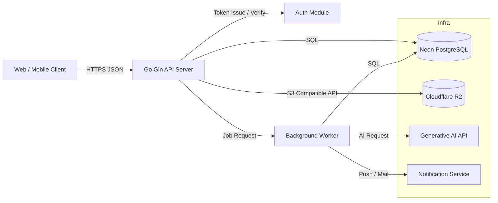
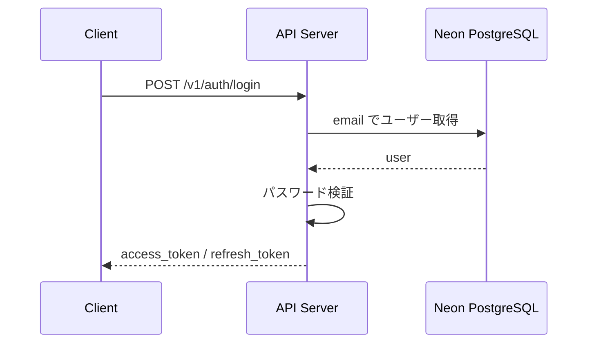
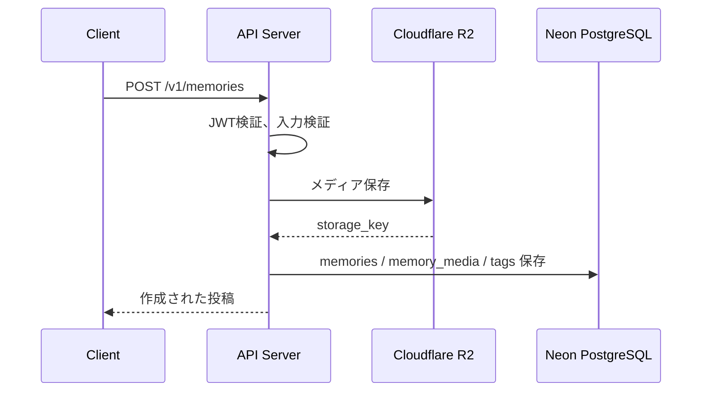
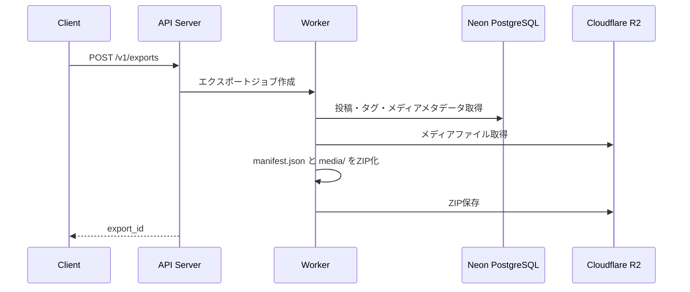
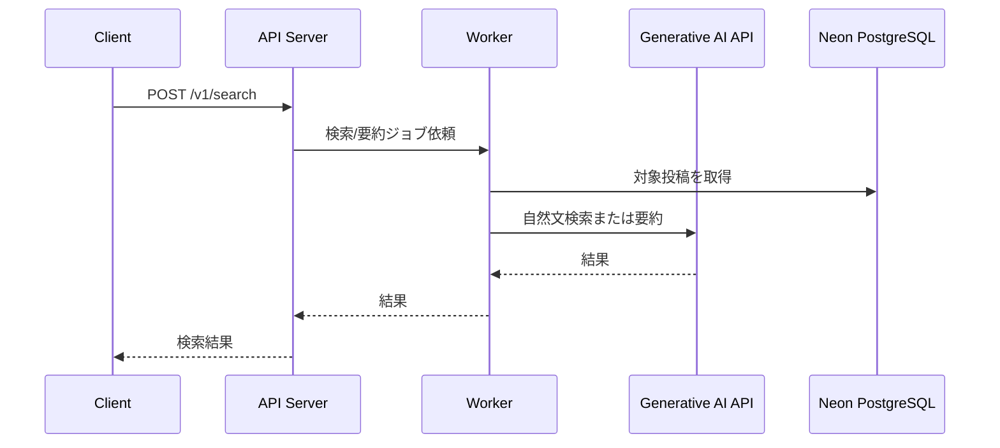

# アーキテクチャ

## システム構成

バックエンドは Go + Gin の REST API として実装する。MVPでは同期APIを中心に構成し、生成AI処理や通知のように時間がかかる処理は将来的に非同期ワーカーへ分離する。



## コンポーネント責務

| コンポーネント | 責務 |
| --- | --- |
| Web / Mobile Client | 投稿作成、閲覧、ログイン、検索などの画面を提供する。 |
| API Server | 認証、投稿、閲覧、メディア、共有、統計のREST APIを提供する。 |
| Auth Module | パスワードハッシュ化、ログイン検証、JWT発行、認証ミドルウェアを担当する。 |
| Neon PostgreSQL | ユーザー、投稿、タグ、感情、公開範囲、フォロー関係などの永続化を行う。 |
| Cloudflare R2 | 写真、動画、音声などのバイナリファイルを保存する。S3互換APIで操作し、DBには公開URLではなく保存先キーとメタデータを保存する。 |
| Background Worker | AI検索・要約、通知、エクスポートなど時間がかかる処理を実行する。 |
| Generative AI API | 自然文検索、投稿要約、思い出の抽出に利用する。 |
| Notification Service | 過去投稿のリマインド通知を送信する。 |

## レイヤ構成

API Server 内部は以下の責務分離を基本とする。

```text
handler    HTTPリクエスト/レスポンス、入力バリデーション
service    ユースケース、認可、トランザクション制御
repository DBアクセス
model      ドメインモデル、DBモデル
middleware 認証、ロギング、リカバリ
config     環境変数、外部サービス設定
```

## 代表的な処理フロー

### ログイン



### 思い出投稿



### データエクスポート



エクスポートZIPには、投稿・タグ・メディアメタデータを含む `manifest.json` と、実ファイルを配置する `media/` ディレクトリを含める。`manifest.json` にはアプリ内のメディアID、投稿ID、相対ファイルパス、MIMEタイプ、ファイルサイズ、チェックサムを含め、別の保存先へ移行しても投稿とメディアの紐づけを復元できるようにする。

### AI検索・要約



MVPでは Worker を分離せず API Server 内で同期処理してもよい。ただし、AI処理は通常APIと分け、タイムアウトやレート制限を個別に管理する。

## CORS方針

CORSの許可オリジンはフロントエンドのデプロイ先が決まり次第確定する。暫定方針は以下とする。

- 開発環境ではフロントエンド開発サーバーのlocalhostのみ許可する。
- 本番環境では確定したフロントエンドドメインのみ許可する。
- `*` による全許可は行わない。
- 許可オリジンは環境変数で管理する。

## 認証・認可方針

- 認証必須APIでは `Authorization: Bearer <access_token>` を利用する。
- ログイン成功時に `access_token` と `refresh_token` を発行する。
- `access_token` は短期有効とし、期限切れ時は `/v1/auth/refresh` で再発行する。
- `refresh_token` はDBにハッシュ化して保存し、ログアウト時に失効させる。
- 自分の投稿は本人のみ閲覧できる。
- `visibility = mutual_followers` の投稿は相互フォロー関係があるユーザーのみ閲覧できる。
- `visibility = private` の投稿は本人のみ閲覧できる。
- 管理者権限は通常ユーザーAPIとは分離する。

## 環境変数

| 変数名 | 用途 |
| --- | --- |
| `PORT` | APIサーバーの待受ポート |
| `DATABASE_URL` | Neon PostgreSQL の接続文字列 |
| `JWT_SECRET` | JWT署名秘密鍵 |
| `R2_ACCOUNT_ID` | Cloudflare R2 のアカウントID |
| `R2_ACCESS_KEY_ID` | R2操作用アクセスキー |
| `R2_SECRET_ACCESS_KEY` | R2操作用シークレットキー |
| `R2_BUCKET` | メディア保存先バケット |
| `R2_ENDPOINT` | S3互換APIのエンドポイント |
| `AI_API_KEY` | 生成AI APIキー |
| `CORS_ALLOWED_ORIGINS` | CORSで許可するオリジンのカンマ区切り一覧 |
