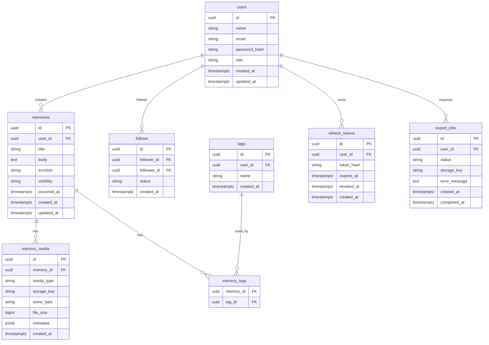

# データベース設計

## 概要

DB は PostgreSQL を想定する。ユーザーの記憶データを長期保存するため、主キーは UUID、日時は timezone 付きの `timestamptz` を基本とする。

メディアファイル本体はDBに保存せず、オブジェクトストレージに保存する。DBには保存先キー、ファイル種別、メタデータのみを保持する。

## エンティティ一覧

## テーブル定義

### users

ユーザー情報を保持する。

| カラム | 型 | 制約 | 説明 |
| --- | --- | --- | --- |
| `id` | uuid | PK | ユーザーID |
| `name` | varchar(100) | not null | 表示名 |
| `email` | varchar(255) | not null, unique | メールアドレス |
| `password_hash` | varchar(255) | not null | パスワードハッシュ |
| `role` | varchar(20) | not null | `user`, `admin` |
| `created_at` | timestamptz | not null | 作成日時 |
| `updated_at` | timestamptz | not null | 更新日時 |

### refresh_tokens

ログイン継続用のリフレッシュトークンを保持する。

| カラム | 型 | 制約 | 説明 |
| --- | --- | --- | --- |
| `id` | uuid | PK | トークンID |
| `user_id` | uuid | FK, not null | ユーザーID |
| `token_hash` | varchar(255) | not null, unique | トークンのハッシュ |
| `expires_at` | timestamptz | not null | 有効期限 |
| `revoked_at` | timestamptz | nullable | 失効日時 |
| `created_at` | timestamptz | not null | 作成日時 |

### memories

思い出投稿の本文、感情、公開範囲を保持する。

| カラム | 型 | 制約 | 説明 |
| --- | --- | --- | --- |
| `id` | uuid | PK | 投稿ID |
| `user_id` | uuid | FK, not null | 投稿者ID |
| `title` | varchar(200) | nullable | タイトル |
| `body` | text | not null | 本文 |
| `emotion` | varchar(30) | nullable | 感情 |
| `visibility` | varchar(30) | not null | `private`, `mutual_followers` |
| `occurred_at` | timestamptz | not null | 出来事が起きた日時 |
| `created_at` | timestamptz | not null | 作成日時 |
| `updated_at` | timestamptz | not null | 更新日時 |

### memory_media

投稿に紐づく写真、動画、音声を保持する。

| カラム | 型 | 制約 | 説明 |
| --- | --- | --- | --- |
| `id` | uuid | PK | メディアID |
| `memory_id` | uuid | FK, not null | 投稿ID |
| `media_type` | varchar(20) | not null | `image`, `video`, `audio` |
| `storage_key` | varchar(500) | not null | オブジェクトストレージ上のキー |
| `mime_type` | varchar(100) | not null | MIMEタイプ |
| `file_size` | bigint | not null | ファイルサイズ |
| `metadata` | jsonb | not null default '{}' | 幅、高さ、再生時間など |
| `created_at` | timestamptz | not null | 作成日時 |

### tags

ユーザーごとのタグを保持する。

| カラム | 型 | 制約 | 説明 |
| --- | --- | --- | --- |
| `id` | uuid | PK | タグID |
| `user_id` | uuid | FK, not null | 所有ユーザーID |
| `name` | varchar(50) | not null | タグ名 |
| `created_at` | timestamptz | not null | 作成日時 |

### memory_tags

投稿とタグの中間テーブル。

| カラム | 型 | 制約 | 説明 |
| --- | --- | --- | --- |
| `memory_id` | uuid | PK, FK | 投稿ID |
| `tag_id` | uuid | PK, FK | タグID |

### follows

ユーザー間のフォロー関係を保持する。相互フォロー判定は `follower_id -> followee_id` と `followee_id -> follower_id` の両方が存在するかで判定する。

| カラム | 型 | 制約 | 説明 |
| --- | --- | --- | --- |
| `id` | uuid | PK | フォローID |
| `follower_id` | uuid | FK, not null | フォローするユーザー |
| `followee_id` | uuid | FK, not null | フォローされるユーザー |
| `status` | varchar(20) | not null | `active`, `blocked` |
| `created_at` | timestamptz | not null | 作成日時 |

### export_jobs

JSONエクスポートの作成状態を保持する。

| カラム | 型 | 制約 | 説明 |
| --- | --- | --- | --- |
| `id` | uuid | PK | エクスポートID |
| `user_id` | uuid | FK, not null | 依頼ユーザーID |
| `status` | varchar(20) | not null | `queued`, `processing`, `completed`, `failed` |
| `storage_key` | varchar(500) | nullable | 完成したJSONファイルの保存先 |
| `error_message` | text | nullable | 失敗理由 |
| `created_at` | timestamptz | not null | 作成日時 |
| `completed_at` | timestamptz | nullable | 完了日時 |

## 値定義

### memories.visibility

| 値 | 説明 |
| --- | --- |
| `private` | 本人のみ閲覧可能 |
| `mutual_followers` | 相互フォロワーのみ閲覧可能 |

### memories.emotion

初期値は以下を想定する。将来的にユーザー定義や強度スコアを追加してもよい。

| 値 | 説明 |
| --- | --- |
| `happy` | 嬉しい |
| `fun` | 楽しい |
| `neutral` | 普通 |
| `sad` | 悲しい |
| `angry` | 怒り |

## インデックス・制約

- `users.email` にユニーク制約を設定する。
- `tags(user_id, name)` にユニーク制約を設定する。
- `follows(follower_id, followee_id)` にユニーク制約を設定する。
- `memories(user_id, occurred_at desc)` にインデックスを設定する。
- `memories(user_id, emotion)` にインデックスを設定する。
- `memory_tags(tag_id, memory_id)` にインデックスを設定する。
- `refresh_tokens(user_id, expires_at)` にインデックスを設定する。
- `export_jobs(user_id, created_at desc)` にインデックスを設定する。

## 削除方針

- MVPでは投稿の編集・削除は必須範囲外とする。
- 将来的に削除機能を追加する場合は、監査や復旧を考慮して論理削除 `deleted_at` の追加を検討する。
- ユーザー退会時は、個人データの扱いを利用規約と運用方針に合わせて決定する。

## マイグレーション方針

- マイグレーションツールは `golang-migrate` を候補とする。
- マイグレーションファイルは `migrations/` 配下でバージョン管理する。
- 本番適用前にステージング環境で適用確認を行う。
- 破壊的変更は原則として段階的に行い、既存データを保持する。
- 初期開発中でも、DBスキーマ変更はマイグレーションとして残す。
